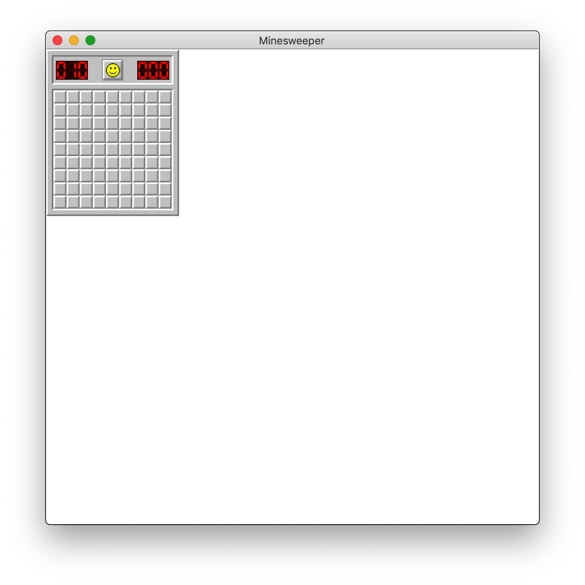
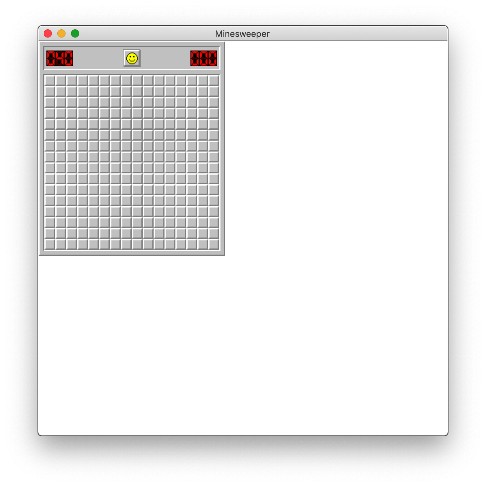
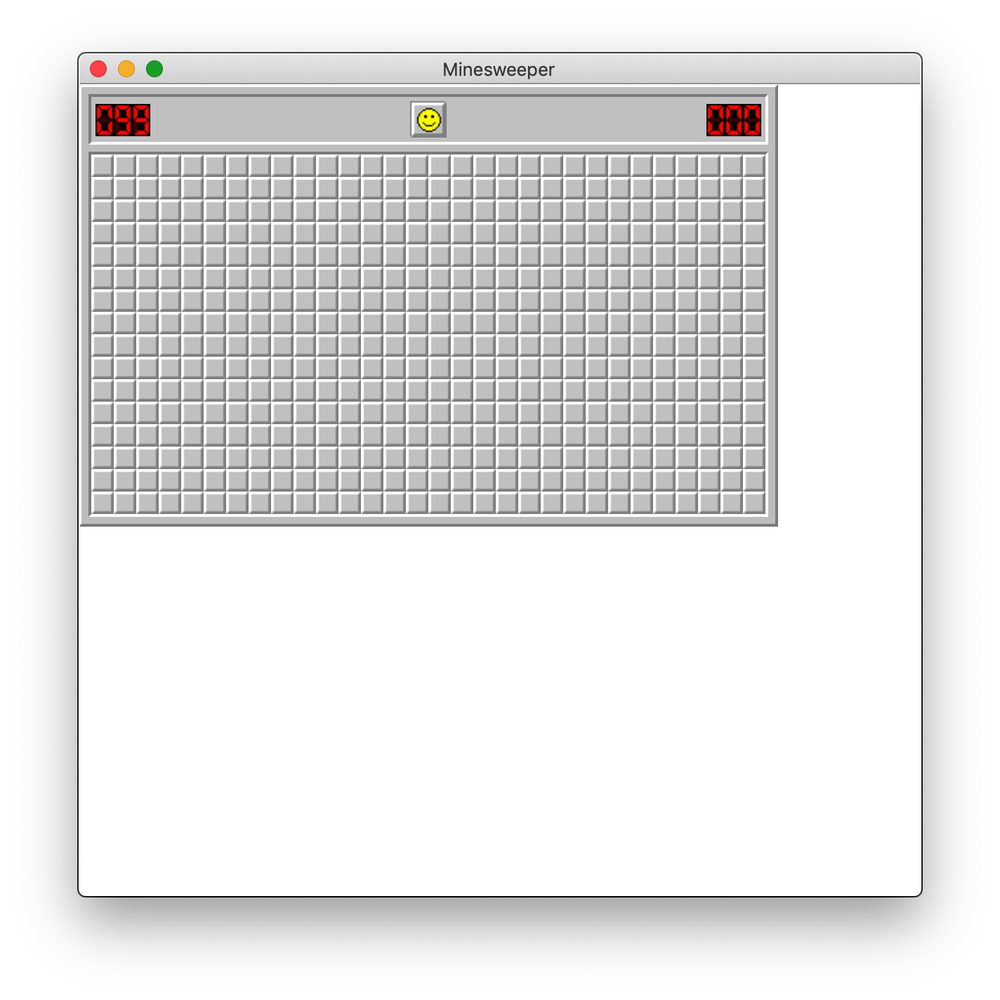
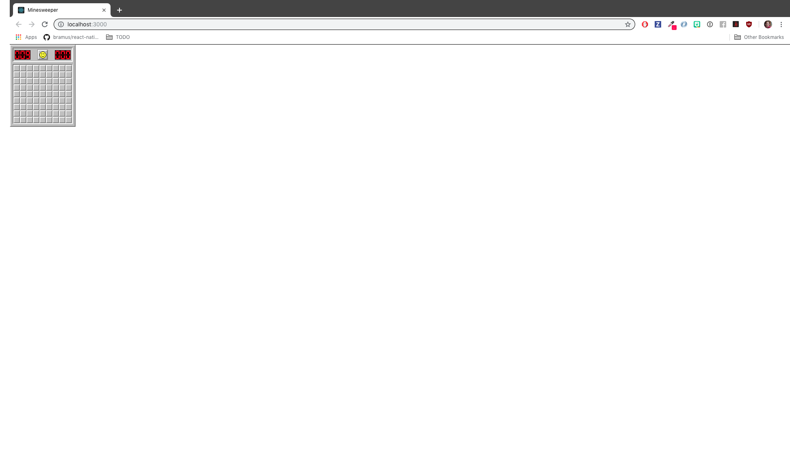

# MineSweeper

MineSweeper in Electron and React. Will make a React Native version here as well. I just want to see how much code I can actually share between Web/Desktop/Mobile apps.

## Setup

1. clone repo
2. `npm install`

### Run Electron App

1. `npm run electron-dev` *starts electron app*
1. `npm run start` *starts react*

## Screenshots

### Electron

### Web

              
## TODO
 - [ ] Resize electron windows on level change.
 - [ ] Store highscores.
 - [ ] Black and white option.
 - [ ] Web UI.
 - [ ] Working React Native App.
